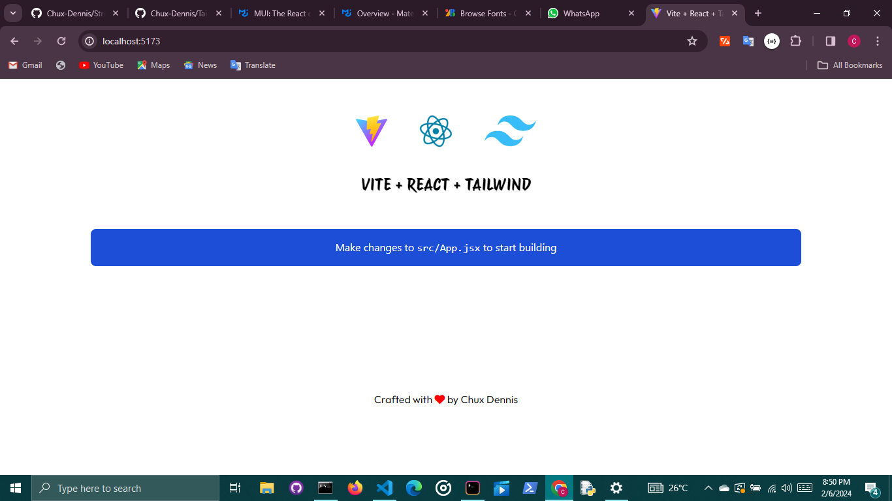

# React + Vite + Tailwind



This projects utilizes Vite to kick start your server for your React production build.

## About

This repo provides boiler plate for building a React App with Tailwind Configuration.

## Built With

- Tailwind Config.
- React(JSX)

# Getting Started with this repo

The following stated instructions below should be followed carefully for the successful cloning and tweaking of this repo.

## Prerequisites

- Git - Git must be installed on your local system in order to clone this repo.
- Node(NPM) - Node should installed on your local machine in order to use NPM
- Vite

## Installation

- Clone this repository

```bash
       cd path git clone https://github.com/Chux-Dennis/Tailwind-React-Template.git
```

- Install required dependencies

```bash
      npm install
```

- Kick start your server

```bash
      npm run dev
```

## Usage

The repo provides bolierplate for building with React with Tailwind

## Deployment

This boilerplate template is NOT live. As its primary purpose was not directed towards deployment.

# Contributions and Feedback

We all love Open Source :) ❤❤ .Contributions are what make the open source community such an amazing place to learn, inspire, and create. Do well to push feedbacks on [Twitter](https://twitter.com/chuxdennis). I am currently open to collaborations , feel free to contact me too.

# LICENSE

Distributed under the MIT License. See [LICENSE](LICENSE) for more information.

# Acknowledgement

All sole acknowledge goes to my **team** and the Github Open Source Community.
